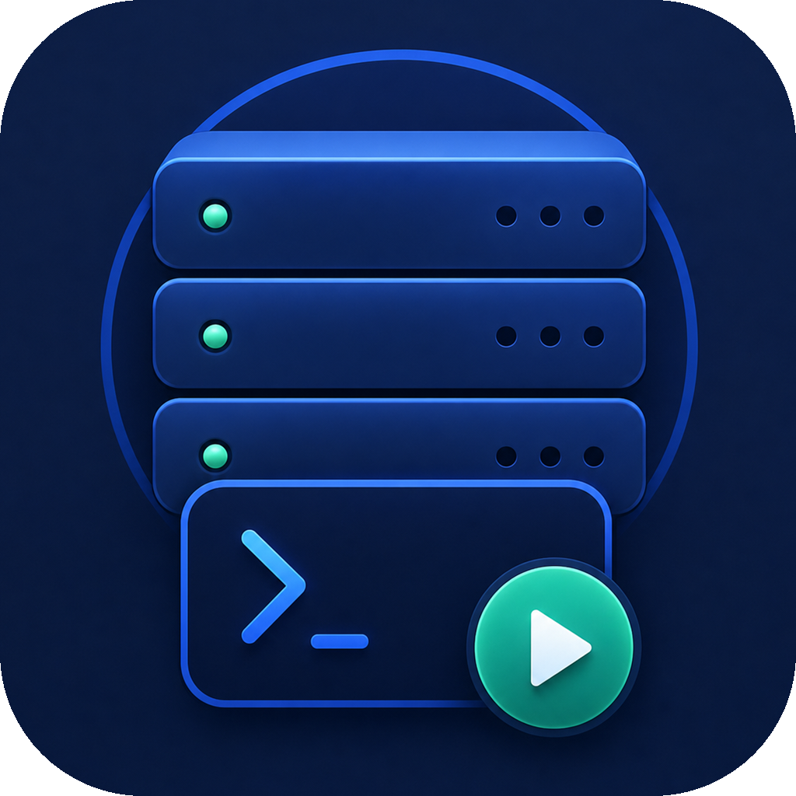

# 本地服务管理器 / Local Server Manager

<p align="center">
  
</p>

<p align="center">
  <strong>A lightweight Windows desktop app for managing local development services.</strong>
</p>

<p align="center">
  <a href="#english">English</a> ·
  <a href="#简体中文">简体中文</a>
</p>

<p align="center">
  
  
  
  
</p>

---

## English

Local Server Manager is a desktop tool for developers who run many local projects at the same time. It helps you keep frontend, backend, and custom services in one place, start or stop them with one click, inspect logs, and run project-specific commands without switching between terminal windows.

### Highlights

- **Project-based service list**: group frontend and backend services under the same local project.
- **Automatic stack detection**: detect React, Vue, Flutter, Flask, FastAPI, Uvicorn, Spring Boot with Maven, and Spring Boot with Gradle.
- **Smart launch commands**: infer common development commands and pass configured ports to frontend and backend dev servers when possible.
- **Service environment variables**: set per-service `KEY=value` entries for local secrets, tool paths, and project-specific runtime configuration.
- **Configuration sync**: update common frontend and backend config files when service ports or linked backend ports change.
- **Custom commands**: manage one-off tasks and long-running commands for each service.
- **Independent logs**: service logs and command logs are stored separately and can be copied or cleared.
- **Port control**: configure service ports, get a suggested fallback when a port is occupied, and stop external services directly by port.
- **Local-first design**: data is stored locally with SQLite; runtime logs are cleared when the app exits.
- **Windows installer**: packaged with Electron Builder and NSIS.

### Supported Stacks

| Stack | Detection hints | Typical commands |
| --- | --- | --- |
| React / Vite / Next.js | `package.json`, React dependencies | `npm run dev`, `pnpm dev`, `yarn dev` |
| Vue | `package.json`, Vue dependencies | `npm run dev`, `pnpm dev`, `yarn serve` |
| Flutter | `pubspec.yaml` | `flutter run -d windows`, `flutter pub get` |
| Flask | `requirements.txt`, `pyproject.toml`, `app.py` | `flask --app app run` |
| FastAPI / Uvicorn | `main.py`, `requirements.txt`, FastAPI/Uvicorn hints | `uvicorn main:app --reload` |
| Spring Boot / Maven | `pom.xml` | `mvn spring-boot:run`, `mvn package` |
| Spring Boot / Gradle | `build.gradle`, `build.gradle.kts`, `gradlew` | `gradlew bootRun`, `gradlew build` |
| Custom | manual configuration | any shell command |

### Installation

Download the Windows installer from the release artifacts:

```text
本地服务管理器 Setup 1.0.9.exe
```

Run the installer and launch **本地服务管理器** from the desktop shortcut or the Start Menu.

### Usage

1. Click **Add Project** and choose a local project folder.
2. Review detected services and save the project.
3. Set or adjust service ports when needed.
4. Edit a service and add environment variables such as `TOKEN_SECRET=...` or `PATH=D:\apache-maven-3.9.8\bin;%PATH%` when a project needs them.
5. Click the play button to start a service.
6. Open **Logs** to inspect service output.
7. Open **Commands** to run scripts such as install, build, test, clean, or custom commands.
8. Use **Stop by Port** to stop a process that was not started by this app.

### Development

Requirements:

- Windows 10 or newer
- Node.js 20 or newer
- npm

Install dependencies:

```bash
npm install
```

Start the development app:

```bash
npm run dev
```

Build the app:

```bash
npm run build
```

Create the Windows installer:

```bash
npm run dist
```

### Project Structure

```text
src/
  main/       Electron main process, SQLite, stack detection, process control
  preload/    Secure IPC bridge
  renderer/   React desktop interface
  shared/     Shared types and defaults
tests/        Unit tests
build/        Application icon assets
dist/         Packaged artifacts
```

### Privacy

Local Server Manager is local-first. It does not require a cloud account and does not send project paths, logs, or commands to any remote service. SQLite data and runtime logs stay on your machine.

### Contributing

Issues and pull requests are welcome. For larger changes, please open an issue first and describe the problem, proposed behavior, and expected user workflow.

### License

MIT

---

## 简体中文

本地服务管理器是一个面向本地开发的 Windows 桌面工具，用来统一管理多个本地项目的前端、后端和自定义服务。你可以一键启动/停止服务、查看日志、管理项目自带命令，减少在多个终端窗口之间来回切换。

### 核心功能

- **按项目管理服务**：一个项目下统一管理前端、后端和其他本地服务。
- **自动识别技术栈**：支持 React、Vue、Flutter、Flask、FastAPI、Uvicorn、Spring Boot Maven、Spring Boot Gradle。
- **自动推断启动命令**：识别常见开发命令，并尽量把配置端口传给前端和后端开发服务器。
- **服务级环境变量**：每个服务可单独配置 `KEY=value`，用于本地密钥、工具路径和项目运行参数。
- **配置文件同步**：服务端口或关联后端端口变化时，同步更新常见前后端配置文件。
- **服务命令管理**：每个服务可以维护一次性命令和长期运行命令。
- **独立日志**：服务日志和命令日志分开保存、复制和清理。
- **端口管理**：可配置服务端口，端口冲突时给出建议端口，也可以直接按端口停止外部服务。
- **本地优先**：数据保存在本机 SQLite；运行日志会在应用退出时清理。
- **Windows 安装包**：使用 Electron Builder 和 NSIS 打包。

### 支持的技术栈

| 技术栈 | 识别依据 | 常见命令 |
| --- | --- | --- |
| React / Vite / Next.js | `package.json`、React 依赖 | `npm run dev`、`pnpm dev`、`yarn dev` |
| Vue | `package.json`、Vue 依赖 | `npm run dev`、`pnpm dev`、`yarn serve` |
| Flutter | `pubspec.yaml` | `flutter run -d windows`、`flutter pub get` |
| Flask | `requirements.txt`、`pyproject.toml`、`app.py` | `flask --app app run` |
| FastAPI / Uvicorn | `main.py`、`requirements.txt`、FastAPI/Uvicorn 线索 | `uvicorn main:app --reload` |
| Spring Boot / Maven | `pom.xml` | `mvn spring-boot:run`、`mvn package` |
| Spring Boot / Gradle | `build.gradle`、`build.gradle.kts`、`gradlew` | `gradlew bootRun`、`gradlew build` |
| Custom | 手动配置 | 任意 shell 命令 |

### 安装

从 release 产物中下载安装包：

```text
本地服务管理器 Setup 1.0.9.exe
```

安装完成后，可以从桌面快捷方式或开始菜单启动 **本地服务管理器**。

### 使用方式

1. 点击 **添加项目**，选择本地项目目录。
2. 检查自动扫描出的服务并保存项目。
3. 按需调整服务端口。
4. 编辑服务并补充环境变量，比如 `TOKEN_SECRET=...` 或 `PATH=D:\apache-maven-3.9.8\bin;%PATH%`。
5. 点击播放按钮启动服务。
6. 打开 **日志** 查看服务输出。
7. 打开 **命令** 运行 install、build、test、clean 或自定义命令。
8. 使用 **按端口停止** 停止不是由本软件启动的本地服务。

### 本地开发

环境要求：

- Windows 10 或更高版本
- Node.js 20 或更高版本
- npm

安装依赖：

```bash
npm install
```

启动开发版：

```bash
npm run dev
```

构建应用：

```bash
npm run build
```

生成 Windows 安装包：

```bash
npm run dist
```

### 项目结构

```text
src/
  main/       Electron 主进程、SQLite、技术栈识别、进程控制
  preload/    安全 IPC 桥接
  renderer/   React 桌面界面
  shared/     共享类型和默认值
tests/        单元测试
build/        应用图标资源
dist/         打包产物
```

### 隐私说明

本地服务管理器是本地优先应用，不需要云账号，也不会上传项目路径、日志或命令。SQLite 数据和运行日志都保存在你的本机。

### 参与贡献

欢迎提交 issue 和 pull request。较大的改动建议先开 issue，说明问题、预期行为和用户使用流程。

### 许可证

MIT
